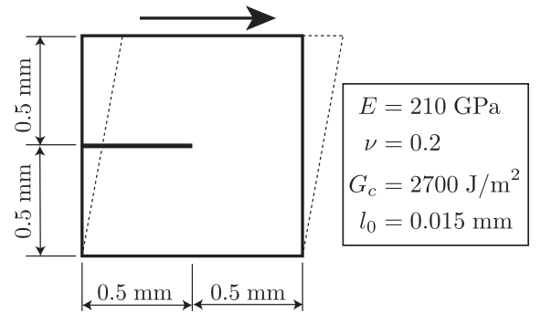

# Phase-Field Fracture Simulation in FEniCSx

This repository contains a Python implementation of a 2D **Phase-Field Fracture (PFF)** simulation using the open-source finite element framework **FEniCSx (DOLFINx)**. The code solves the quasi-static brittle fracture problem for an elastic square domain subjected to pure shear loading with an initial horizontal edge crack.
The problem is solved using a staggered (alternate minimization) scheme, which iteratively solves the displacement and damage fields to update the system state, prioritizing computational stability.

## 📌 Problem Description
The model simulates a unit square plate ($1.0 \times 1.0$) with an initial horizontal edge crack.
* **Geometry:** Unit Square $[0, 1] \times [0, 1]$.
* **Initial Flaw:** A horizontal pre-crack at mid-height ($y=0.5$) extending from $x=0$ to $x=0.5$.
* **Loading:** The top boundary is subjected to a prescribed horizontal displacement ($\Delta u$) to induce shear, while vertical movement is constrained on the top, left, and right boundaries ($u_y = 0$).

> 

> *Figure 1: Problem geometry and boundary conditions.*

## 🧮 Theoretical Background

### 1. The Phase-Field Approach
The phase-field approach regularizes sharp crack topologies over a domain using a continuous damage variable $d \in [0, 1]$, where $d=0$ indicates intact material and $d=1$ indicates fully broken material. The width of the smeared crack is controlled by the length scale parameter $l_0$.

### 2. Energetic Degradation
To couple the damage and mechanical fields, we use a quadratic degradation function $g(d)$ that reduces the material's stiffness as damage increases:
          $$g(d) = (1 - d)^2 + k_{res}$$
where $k_{res} = 10^{-6}$ is a small residual stiffness parameter introduced to prevent numerical singularities when the material is fully damaged.

### 3. Strain Energy & History Field
The isotropic elastic strain energy density $\psi_0(u)$ is given by:
          $$\psi_0(u) = \frac{1}{2} \lambda (\text{tr}(\epsilon))^2 + \mu \epsilon : \epsilon$$
To enforce crack irreversibility (damage can only grow), a history field variable $\mathcal{H}$ is introduced. It tracks the maximum strain energy density obtained during the loading history:
          $$\mathcal{H}(x, t) = \max_{s \in [0, t]} \psi_0(u(x, s))$$

### 3. Governing Equations (Strong Form)
For a quasi-static brittle fracture problem, the equilibrium and damage evolution equations are:

** Momentum Balance:**
$$\nabla \cdot \sigma = 0 \quad \text{in } \Omega$$
$$\sigma = g(d) \left[ 2\mu\epsilon(u) + \lambda\text{tr}(\epsilon(u))\mathbf{I} \right]$$

**Damage Evolution:**
$$\frac{G_c}{l_0} d - G_c l_0 \Delta d = 2(1 - d) \mathcal{H}$$
where $G_c$ is the fracture toughness 

### 4. Weak Form (Variational Formulation)
The finite element implementation solves the following variational statements:

**Displacement Field ($\Pi_u$):**
$$\int_{\Omega} \sigma(u, d) : \epsilon(v) \, dx = 0 \quad \forall v \in V_u$$

**Damage Field ($\Pi_d$):**
$$\int_{\Omega} \left[ \frac{G_c}{l_0} d w + G_c l_0 \nabla d \cdot \nabla w \right] dx = \int_{\Omega} 2(1 - d) \mathcal{H} w \, dx \quad \forall w \in V_d$$

## 🛠 Numerical Implementation

### Implementation Details
1. Mesh: $250 \times 250$ elements ($h = 0.004$), ensuring $l_0 \geq 5h$ to properly resolve the damage band.
2. Solver Setup: SNES Newton-Krylov solver (newtonls) coupled with a MUMPS direct linear solver (pc_type: lu).
3. Pre-crack initialization: The history field $\mathcal{H}$ is artificially forced to $10^6$ at the initial crack location     to instantly drive $d=1$ in that localized band without requiring complex mesh tagging.

### Staggered Solver (Alternate Minimization)
1.  **Solve Displacement ($u$):** Fix $d$, solve for $u$ using Newton method.
2.  **Update History Field ($\mathcal{H}$):** $\mathcal{H} = \max(\psi_0, \mathcal{H}_{old})$.
3.  **Solve Damage ($d$):** Fix $u$, solve for $d$ using Newton method.


## 📊 Results & Visualization

### Crack Propagation Animation
The following animation shows the evolution of the damage field $d$ as the shear displacement increases. The pre-crack acts as the initiation site for the crack path.

> 

> *Figure 2: Evolution of the damage field during shear loading.*

### Load vs. Displacement Curve
The reaction force is integrated over the top boundary to produce the global structural response. The sudden drop in load corresponds to the rapid growth of the fracture.

> 

> *Figure 3: Global reaction force vs. applied displacement.*

## 🚀 How to Run

### Prerequisites
* FEniCSx (DOLFINx)
* PETSc / mpi4py

### Execution
This script requires a FEniCSx (DOLFINx) environment. If you are using WSL or a Docker container, run the script via Python:
```bash
python3 phase_field_shear.py
```
Output files (.xdmf for ParaView visualization and .csv for data plotting) are generated in the specified directory.
